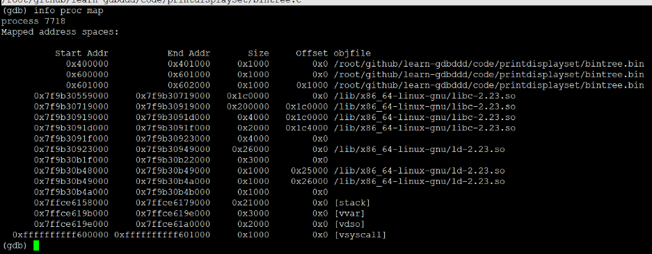
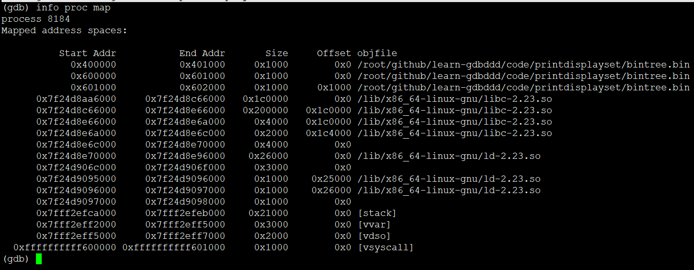
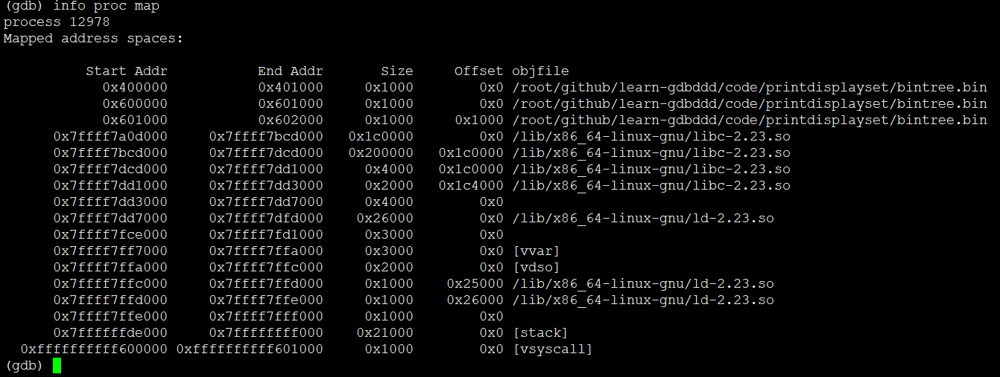
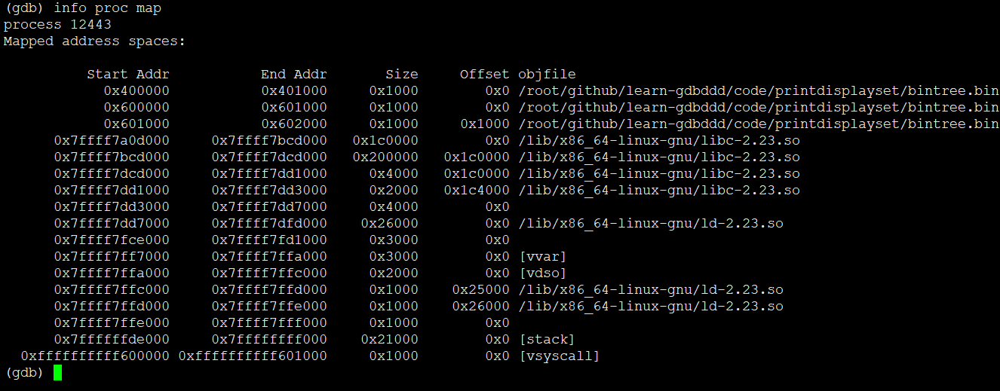

<!-- TOC depthFrom:1 depthTo:6 withLinks:1 updateOnSave:1 orderedList:0 -->

- [ASLR地址空间布局随机化](#aslr地址空间布局随机化)
	- [ASLR简介](#aslr简介)
	- [ASLR地址空间布局随机化实现原理](#aslr地址空间布局随机化实现原理)
		- [ASLR分级](#aslr分级)
		- [ASLR 并不负责代码段和数据段的随机化(验证)](#aslr-并不负责代码段和数据段的随机化验证)
	- [Linux内核ASLR开关](#linux内核aslr开关)
	- [gdb调试开启地址空间布局随机化](#gdb调试开启地址空间布局随机化)
		- [gdb中开启ASLR](#gdb中开启aslr)
		- [gdb中关闭ASLR(默认调试自动关闭)](#gdb中关闭aslr默认调试自动关闭)

<!-- /TOC -->
# ASLR地址空间布局随机化

## ASLR简介

**ASLR，全称为 Address Space Layout Randomization，地址空间布局随机化**。ASLR 技术在 2005 年的 **kernel 2.6.12 ** 中被引入到 Linux 系统，它将进程的某些内存空间地址进行随机化来增大入侵者预测目的地址的难度，从而降低进程被成功入侵的风险。当前 Linux、Windows 等主流操作系统都已经采用该项技术。

## ASLR地址空间布局随机化实现原理

### ASLR分级
Linux 平台上 ASLR 分为 0，1，2 三级，用户可以通过一个内核参数 randomize_va_space 进行等级控制。它们对应的效果如下：

* 0：没有随机化。即关闭 ASLR。
* 1：保留的随机化。共享库、栈、mmap() 以及 VDSO 将被随机化。
* 2：完全的随机化。在 1 的基础上，通过 brk() 分配的内存空间也将被随机化。

看到这里列出的几项内存空间，很自然有两个地方十分值得注意，第一，代码段以及数据段（data段和bss段）是否被随机化了？第二，堆是否被随机化了？

### ASLR 并不负责代码段和数据段的随机化(验证)

## Linux内核ASLR开关

通过在root下执行echo "0" > /proc/sys/kernel/randomize_va_space可以关掉ASLR
ALSR可以保证在每次程序加载的时候他自己和所加载的库文件都会被映射到虚拟地址空间的不同地址处，这就意味着我们不能使用自己在gdb中调试的地址了。因为有可能变成另一个。

## gdb调试开启地址空间布局随机化

注意：在我们调试一个程序的时候，GDB会自动关掉ASLR，但是为了更加真实地看到程序，可以把它打开。
 set disable-randomization off 在gbd中设置之后，利用i poc map可以看函数映射表，大多数都不一一样，但是还有的模块是一样的。这就是在ASLR被开启的情况下，漏洞仍然可以利用成功的关键原因。

### gdb中开启ASLR

### gdb中关闭ASLR(默认调试自动关闭)

* 明显看到两次运行效果一样。在同一个gdb调试环境下start运行多次还是，退出gdb再次进入。

 ## END
