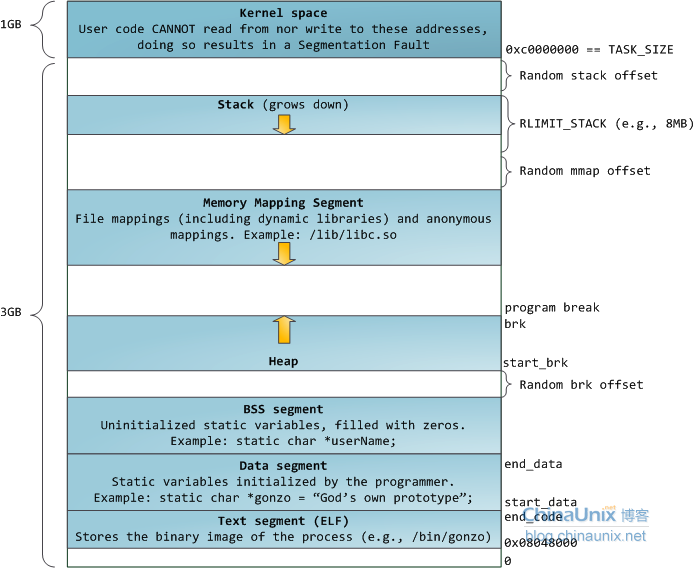

<!-- TOC depthFrom:1 depthTo:6 withLinks:1 updateOnSave:1 orderedList:0 -->

- [基础-Linux进程内存布局](#基础-linux进程内存布局)
	- [x86 Linux进程虚拟地址空间内存布局](#x86-linux进程虚拟地址空间内存布局)
		- [0~3G虚拟地址空间分配策略](#03g虚拟地址空间分配策略)
		- [3G~4G虚拟地址空间分配策略](#3g4g虚拟地址空间分配策略)
	- [x86_64 Linux进程虚拟地址空间内存布局](#x8664-linux进程虚拟地址空间内存布局)
	- [END](#end)

<!-- /TOC -->
# 基础-Linux进程内存布局

## x86 Linux进程虚拟地址空间内存布局

在多任务操作系统中的每一个进程都运行在一个属于它自己的内存沙盘中。这个沙盘就是虚拟地址空间（virtual address space），在32位模式下它总是一个4GB的内存地址块。这些虚拟地址通过页表（page table）映射到物理内存，页表由操作系统维护并被处理器引用。每一个进程拥有一套属于它自己的页表，但是还有一个隐情。只要虚拟地址被使能，那么它就会作用于这台机器上运行的所有软件，包括内核本身。因此一部分虚拟地址必须保留给内核使用：


这并不意味着内核使用了那么多的物理内存，仅表示它可支配这么大的地址空间，可根据内核需要，将其映射到物理内存。内核空间在页表中拥有较高的特权级（ring 2或以下），因此只要用户态的程序试图访问这些页，就会导致一个页错误（page fault）。在Linux中，内核空间是持续存在的，并且在所有进程中都映射到同样的物理内存。内核代码和数据总是可寻址的，随时准备处理中断和系统调用。与此相反，用户模式地址空间的映射随进程切换的发生而不断变化：




* 当计算机开心、安全、可爱、正常的运转时，几乎每一个进程的各个段的起始虚拟地址都与上图完全一致，这也给远程发掘程序安全漏洞打开了方便之门。
* 一个发掘过程往往需要引用绝对内存地址：栈地址，库函数地址等。
* 远程攻击者必须依赖地址空间布局的一致性，摸索着选择这些地址。如果让他们猜个正着，有人就会被整了。因此，地址空间的随机排布方式逐渐流行起来。
* Linux 通过对**栈内存映射段**、**堆的起始地址加上随机的偏移量**来打乱布局。不幸的是，32 位地址空间相当紧凑，给随机化所留下的空当不大，削弱了这种技巧的效果。图上Random * offset就是这个作用。

进程地址空间中最顶部的段是栈，大多数编程语言将之用于存储局部变量和函数参数。调用一个方法或函数会将一个新的栈桢（stack frame）压入栈中。栈桢在函数返回时被清理。也许是因为数据严格的遵从LIFO的顺序，这个简单的设计意味着不必使用复杂的数据结构来追踪栈的内容，只需要一个简单的指针指向栈的顶端即可。因此压栈（pushing）和退栈（popping）过程非常迅速、准确。另外，持续的重用栈空间有助于使活跃的栈内存保持在CPU缓存中，从而加速访问。进程中的每一个线程都有属于自己的栈。


通过不断向栈中压入的数据，超出其容量就有会耗尽栈所对应的内存区域。这将触发一个**页故障（page fault），并被 Linux 的expand_stack()处理**，它会调用acct_stack_growth()来检查是否还有合适的地方用于栈的增长。如果栈的大小低于RLIMIT_STACK（通常是8MB），那么一般情况下栈会被加长，程序继续愉快的运行，感觉不到发生了什么事情。这是一种将栈扩展至所需大小的常规机制。然而，如果达到了最大的栈空间大小，就会栈溢出（stack overflow），程序收到一个段错误（Segmentation Fault）。**当映射了的栈区域扩展到所需的大小后，它就不会再收缩回去，即使栈不那么满了。这就好比联邦预算，它总是在增长的。**

* 动态栈增长是唯一一种访问未映射内存区域（图中白色区域）而被允许的情形。其它任何对未映射内存区域的访问都会触发页故障，从而导致段错误。一些被映射的区域是只读的，因此企图写这些区域也会导致段错误。

在栈的下方，是我们的内存映射段。此处，内核将文件的内容直接映射到内存。任何应用程序都可以通过 Linux 的 mmap() 系统调用（实现）或 Windows 的 CreateFileMapping()/MapViewOfFile()请求这种映射。内存映射是一种方便高效的文件 I/O 方式，所以它被用于加载动态库。创建一个不对应于任何文件的匿名内存映射也是可能的，此方法用于存放程序的数据。在 Linux 中，如果你通过 malloc()请求一大块内存，C 运行库将会创建这样一个匿名映射而不是使用堆内存。‘大块’意味着比MMAP_THRESHOLD 还大，缺省是 128KB ，可以通过mallopt()调整。

说到堆，它是接下来的一块地址空间。与栈一样，堆用于运行时内存分配；但不同点是，堆用于存储那些生存期与函数调用无关的数据。大部分语言都提供了堆管理功能。因此，满足内存请求就成了语言运行时库及内核共同的任务。在 C 语言中，堆分配的接口是malloc()系列函数，而在具有垃圾收集功能的语言（如 C# ）中，此接口是 new 关键字。


如果堆中有足够的空间来满足内存请求，它就可以被语言运行时库处理而不需要内核参与。否则，堆会被扩大，通过brk()系统调用（实现）来分配请求所需的内存块。堆管理是很复杂的，需要精细的算法，应付我们程序中杂乱的分配模式，优化速度和内存使用效率。处理一个堆请求所需的时间会大幅度的变动。实时系统通过特殊目的分配器来解决这个问题。堆也可能会变得零零碎碎，如下图所示：


最后，我们来看看最底部的内存段： BSS，数据段，代码段。

* 在C语言中，BSS和数据段保存的都是静态（全局）变量的内容。区别在于BSS保存的是未被初始化的静态变量内容，它们的值不是直接在程序的源代码中设定的。
* BSS内存区域是匿名的：它不映射到任何文件。如果你写static int cntActiveUsers，则cntActiveUsers的内容就会保存在BSS中。
* 数据段保存在源代码中已经初始化了的静态变量内容。这个内存区域不是匿名的。它映射了一部分的程序二进制镜像，也就是源代码中指定了初始值的静态变量。所以，如果你写static int cntWorkerBees = 10，则cntWorkerBees的内容就保存在数据段中了，而且初始值为10。尽管数据段映射了一个文件，但它是一个私有内存映射，这意味着更改此处的内存不会影响到被映射的文件。也必须如此，否则给全局变量赋值将会改动你硬盘上的二进制镜像，这是不可想象的。

下图中数据段的例子更加复杂，因为它用了一个指针。在此情况下，指针gonzo（4字节内存地址）本身的值保存在数据段中。而它所指向的实际字符串则不在这里。

这个字符串保存在代码段中，代码段是只读的，保存了你全部的代码外加零零碎碎的东西，比如字符串字面值。代码段将你的二进制文件也映射到了内存中，但对此区域的写操作都会使你的程序收到段错误。这有助于防范指针错误，虽然不像在C语言编程时就注意防范来得那么有效。下图展示了这些段以及我们例子中的变量：


你**可以通过阅读文件/proc/pid_of_process/maps来检验一个Linux进程中的内存区域**。记住**一个段可能包含许多区域。比如，每个内存映射文件在mmap段中都有属于自己的区域，动态库拥有类似BSS和数据段的额外区域**。下一篇文章讲说明这些“区域”（area）的真正含义。**有时人们提到“数据段”，指的就是全部的数据段 + BSS + 堆。**

```
root@ubuntu16x64:/proc/3826# cat maps
55c5d91a8000-55c5d91cf000 r-xp 00000000 fc:00 12847113                   /usr/bin/htop
55c5d93cf000-55c5d93d0000 r--p 00027000 fc:00 12847113                   /usr/bin/htop
55c5d93d0000-55c5d93d4000 rw-p 00028000 fc:00 12847113                   /usr/bin/htop
55c5d93d4000-55c5d93d5000 rw-p 00000000 00:00 0
55c5dac66000-55c5dad02000 rw-p 00000000 00:00 0                          [heap]
7f2080ede000-7f2080ee9000 r-xp 00000000 fc:00 262242                     /lib/x86_64-linux-gnu/libnss_files-2.23.so
7f2080ee9000-7f20810e8000 ---p 0000b000 fc:00 262242                     /lib/x86_64-linux-gnu/libnss_files-2.23.so
7f20810e8000-7f20810e9000 r--p 0000a000 fc:00 262242                     /lib/x86_64-linux-gnu/libnss_files-2.23.so
7f20810e9000-7f20810ea000 rw-p 0000b000 fc:00 262242                     /lib/x86_64-linux-gnu/libnss_files-2.23.so
7f20810ea000-7f20810f0000 rw-p 00000000 00:00 0
7f20810f0000-7f20810fb000 r-xp 00000000 fc:00 267804                     /lib/x86_64-linux-gnu/libnss_nis-2.23.so
7f20810fb000-7f20812fa000 ---p 0000b000 fc:00 267804                     /lib/x86_64-linux-gnu/libnss_nis-2.23.so
7f20812fa000-7f20812fb000 r--p 0000a000 fc:00 267804                     /lib/x86_64-linux-gnu/libnss_nis-2.23.so
7f20812fb000-7f20812fc000 rw-p 0000b000 fc:00 267804                     /lib/x86_64-linux-gnu/libnss_nis-2.23.so
7f20812fc000-7f2081312000 r-xp 00000000 fc:00 262169                     /lib/x86_64-linux-gnu/libnsl-2.23.so
7f2081312000-7f2081511000 ---p 00016000 fc:00 262169                     /lib/x86_64-linux-gnu/libnsl-2.23.so
7f2081511000-7f2081512000 r--p 00015000 fc:00 262169                     /lib/x86_64-linux-gnu/libnsl-2.23.so
7f2081512000-7f2081513000 rw-p 00016000 fc:00 262169                     /lib/x86_64-linux-gnu/libnsl-2.23.so
7f2081513000-7f2081515000 rw-p 00000000 00:00 0
7f2081515000-7f208151d000 r-xp 00000000 fc:00 262237                     /lib/x86_64-linux-gnu/libnss_compat-2.23.so
7f208151d000-7f208171c000 ---p 00008000 fc:00 262237                     /lib/x86_64-linux-gnu/libnss_compat-2.23.so
7f208171c000-7f208171d000 r--p 00007000 fc:00 262237                     /lib/x86_64-linux-gnu/libnss_compat-2.23.so
7f208171d000-7f208171e000 rw-p 00008000 fc:00 262237                     /lib/x86_64-linux-gnu/libnss_compat-2.23.so
7f208171e000-7f2081ba9000 r--p 00000000 fc:00 12846557                   /usr/lib/locale/locale-archive
7f2081ba9000-7f2081bac000 r-xp 00000000 fc:00 262231                     /lib/x86_64-linux-gnu/libdl-2.23.so
7f2081bac000-7f2081dab000 ---p 00003000 fc:00 262231                     /lib/x86_64-linux-gnu/libdl-2.23.so
7f2081dab000-7f2081dac000 r--p 00002000 fc:00 262231                     /lib/x86_64-linux-gnu/libdl-2.23.so
7f2081dac000-7f2081dad000 rw-p 00003000 fc:00 262231                     /lib/x86_64-linux-gnu/libdl-2.23.so
7f2081dad000-7f2081f6d000 r-xp 00000000 fc:00 262229                     /lib/x86_64-linux-gnu/libc-2.23.so
7f2081f6d000-7f208216d000 ---p 001c0000 fc:00 262229                     /lib/x86_64-linux-gnu/libc-2.23.so
7f208216d000-7f2082171000 r--p 001c0000 fc:00 262229                     /lib/x86_64-linux-gnu/libc-2.23.so
7f2082171000-7f2082173000 rw-p 001c4000 fc:00 262229                     /lib/x86_64-linux-gnu/libc-2.23.so
7f2082173000-7f2082177000 rw-p 00000000 00:00 0
7f2082177000-7f208227f000 r-xp 00000000 fc:00 262161                     /lib/x86_64-linux-gnu/libm-2.23.so
7f208227f000-7f208247e000 ---p 00108000 fc:00 262161                     /lib/x86_64-linux-gnu/libm-2.23.so
7f208247e000-7f208247f000 r--p 00107000 fc:00 262161                     /lib/x86_64-linux-gnu/libm-2.23.so
7f208247f000-7f2082480000 rw-p 00108000 fc:00 262161                     /lib/x86_64-linux-gnu/libm-2.23.so
7f2082480000-7f20824a5000 r-xp 00000000 fc:00 266803                     /lib/x86_64-linux-gnu/libtinfo.so.5.9
7f20824a5000-7f20826a4000 ---p 00025000 fc:00 266803                     /lib/x86_64-linux-gnu/libtinfo.so.5.9
7f20826a4000-7f20826a8000 r--p 00024000 fc:00 266803                     /lib/x86_64-linux-gnu/libtinfo.so.5.9
7f20826a8000-7f20826a9000 rw-p 00028000 fc:00 266803                     /lib/x86_64-linux-gnu/libtinfo.so.5.9
7f20826a9000-7f20826d6000 r-xp 00000000 fc:00 266713                     /lib/x86_64-linux-gnu/libncursesw.so.5.9
7f20826d6000-7f20828d6000 ---p 0002d000 fc:00 266713                     /lib/x86_64-linux-gnu/libncursesw.so.5.9
7f20828d6000-7f20828d7000 r--p 0002d000 fc:00 266713                     /lib/x86_64-linux-gnu/libncursesw.so.5.9
7f20828d7000-7f20828d8000 rw-p 0002e000 fc:00 266713                     /lib/x86_64-linux-gnu/libncursesw.so.5.9
7f20828d8000-7f20828fe000 r-xp 00000000 fc:00 262227                     /lib/x86_64-linux-gnu/ld-2.23.so
7f2082ad3000-7f2082ad8000 rw-p 00000000 00:00 0
7f2082af6000-7f2082afd000 r--s 00000000 fc:00 13110737                   /usr/lib/x86_64-linux-gnu/gconv/gconv-modules.cache
7f2082afd000-7f2082afe000 r--p 00025000 fc:00 262227                     /lib/x86_64-linux-gnu/ld-2.23.so
7f2082afe000-7f2082aff000 rw-p 00026000 fc:00 262227                     /lib/x86_64-linux-gnu/ld-2.23.so
7f2082aff000-7f2082b00000 rw-p 00000000 00:00 0
7ffee2a51000-7ffee2a72000 rw-p 00000000 00:00 0                          [stack]
7ffee2bdd000-7ffee2be0000 r--p 00000000 00:00 0                          [vvar]
7ffee2be0000-7ffee2be2000 r-xp 00000000 00:00 0                          [vdso]
ffffffffff600000-ffffffffff601000 r-xp 00000000 00:00 0                  [vsyscall]
```


你可以通过nm和objdump命令来察看二进制镜像，打印其中的符号，它们的地址，段等信息。最后需要指出的是，前文描述的虚拟地址布局在Linux 中是一种“灵活布局”（flexible layout），而且以此作为默认方式已经有些年头了。它假设我们有值 RLIMIT_STACK。当情况不是这样时， Linux 退回使用“经典布局”（classic layout），如下图所示：


```
root@ubuntu16x64:~/# nm main.bin
0000000000602060 B __bss_start
0000000000400945 T BTree_Clear
0000000000400cb3 T BTree_Count
00000000004008f1 T BTree_Create
0000000000400cdf T BTree_Degree
0000000000400aba T BTree_Delete
000000000040092a T BTree_Destroy
0000000000400d19 T BTree_Display
0000000000400bbb T BTree_Get
0000000000400c79 T BTree_Height
0000000000400975 T BTree_Insert
0000000000400c48 T BTree_Root
0000000000602060 b completed.7594
0000000000602050 D __data_start
0000000000602050 W data_start
00000000004005f0 t deregister_tm_clones
0000000000400670 t __do_global_dtors_aux
0000000000601e18 t __do_global_dtors_aux_fini_array_entry
0000000000602058 D __dso_handle
0000000000601e28 d _DYNAMIC
0000000000602060 D _edata
0000000000602068 B _end
00000000004011c4 T _fini
0000000000400690 t frame_dummy
0000000000601e10 t __frame_dummy_init_array_entry
00000000004015f8 r __FRAME_END__
                 U free@@GLIBC_2.2.5
0000000000602000 d _GLOBAL_OFFSET_TABLE_
                 w __gmon_start__
0000000000401240 r __GNU_EH_FRAME_HDR
0000000000400508 T _init
0000000000601e18 t __init_array_end
0000000000601e10 t __init_array_start
00000000004011d0 R _IO_stdin_used
                 w _ITM_deregisterTMCloneTable
                 w _ITM_registerTMCloneTable
0000000000601e20 d __JCR_END__
0000000000601e20 d __JCR_LIST__
                 w _Jv_RegisterClasses
00000000004011c0 T __libc_csu_fini
0000000000401150 T __libc_csu_init
                 U __libc_start_main@@GLIBC_2.2.5
0000000000400d90 T main
                 U malloc@@GLIBC_2.2.5
0000000000400d68 T printf_data
                 U printf@@GLIBC_2.2.5
                 U putchar@@GLIBC_2.2.5
                 U puts@@GLIBC_2.2.5
00000000004007ca t recursive_count
000000000040086a t recursive_degree
00000000004006b6 t recursive_display
0000000000400816 t recursive_height
0000000000400630 t register_tm_clones
                 U __stack_chk_fail@@GLIBC_2.4
00000000004005c0 T _start
0000000000602060 D __TMC_END__
```


### 0~3G虚拟地址空间分配策略

纯基础知识，各个分段务必了解其作用和大概线性地址空间中的布局

```
.bss:未初始化的全局静态变量
.data:初始化的全局静态变量
.text:可执行程序，只读，可执行，可共享
.stack:堆栈，可执行不可执行引发安全问题
```

从上图我们可以看到，**用户进程的代码区一般从虚拟地址空间的0x08048000开始**，这是为了便于检查空指针。代码区之上便是数据区，未初始化数据区，堆区，栈区，以及参数、全局环境变量。用户空间内存布局可以分为以下几个方面（用户程序中所申请分配的都是用户空间的虚拟地址）：


**代码段（.text/ code segment）**：这里存放**程序执行代码**（cpu要执行的指令）的一块内存区域。这部分区域在程序运行前就确定了，通常情况下是**只读**的（防止程序由于错误而修改自身指令）。某些结构也允许代码段可写，即可以修改程序。代码段是**可以共享**的，相同的代码在内存中只有一份拷贝。除了代码外，这个区域里面也可能包含一些**只读的常数变量**，如字符串常量  char *p="12345" ,这里“12345”就存在代码段里面。


**初始化数据段（.data segment）**：这里存放的是程序中需要**明确赋初始值的变量**，如已经初始化的**全局变量**。数据段属于**静态内存分配**。包括static变量。


**未初始化数据段（.bss）**：存放**未经初始化的全局变量**。内核在执行该程序前，**将其初始化为0或者null**。BBS（block started by symbol), 属于静态内存分配。

**堆（Heap）**：存放程序中进行**动态内存申请**，例如经常用到的malloc，new系列函数就是从这个段中申请内存。**堆的大小不固定**，可以动态增加（malloc)和缩减（free)

**栈（Stack）**：又称堆栈，函数中的局部变量以及在函数调用过程中产生的临时变量都保存在此段中。（在函数被调用时，其参数也会被压入发起调用的进程栈中，并且待到调用结束后，**函数的返回值也会被存放回栈中**。由于栈的先进先出特点，所以栈特别方便用来保存/恢复调用现场。从这个意义上讲，我们可以把**堆栈看成一个寄存、交换临时数据的内存区**。 ）

```
1. 代码段（.text)和初始化数据段(.data) 都位于程序的可执行文件中，内核在调用exec函数启动该程序时从源程序文件中读入。
2. 栈是自顶向下扩展，栈是有界的（系统为 stack 区域保留了 128M 内存地址空间）。 堆是自底向上扩展，mmap映射区自顶向下扩展，mmap 映射区域和堆相对扩展，直至耗尽虚拟地址空间中的剩余区域，这种结构便于 C 运行时库使用 mmap 映射区域和堆进行内存分配。

3.栈和 mmap 映射区域并不是从一个固定地址开始，并且每次的值都不一样，这是程序在启动时随机改变这些值的设置，使得使用缓冲区溢出进行攻击更加困难。当然也可以让程序的栈和 mmap 映射区域从一个固定位置开始，只需要设置全局变量 randomize_v a_space 值为 0 ，这个变量默认值为 1 。用户可以通过设置/proc/sys/kernel/randomize_va_space 来停用该特性，也可以用如下命令：

       sudo sysctl -w kernel.randomize_va_space=0

4.bss段（未手动初始化的数据）并不给该段的数据分配空间，只是记录数据所需空间的大小。bss中未经初始化 的变量由exec初始化为0.
5.data（已手动初始化的数据）段则为数据分配空间，数据保存在目标文件中。

6. 代码段的大小在连接器链接之前，就得到，数据段包含经过初始化的全局变量以及它们的值，BSS段的大小从可执行文件中得到 ，然后链接器得到这个大小的内存块，紧跟在数据段后面。当这个内存区进入程序的地址空间后全部清零。包含数据段和BSS段的整个区段此时通常称为数据区
```

### 3G~4G虚拟地址空间分配策略


## x86_64 Linux进程虚拟地址空间内存布局


## END
