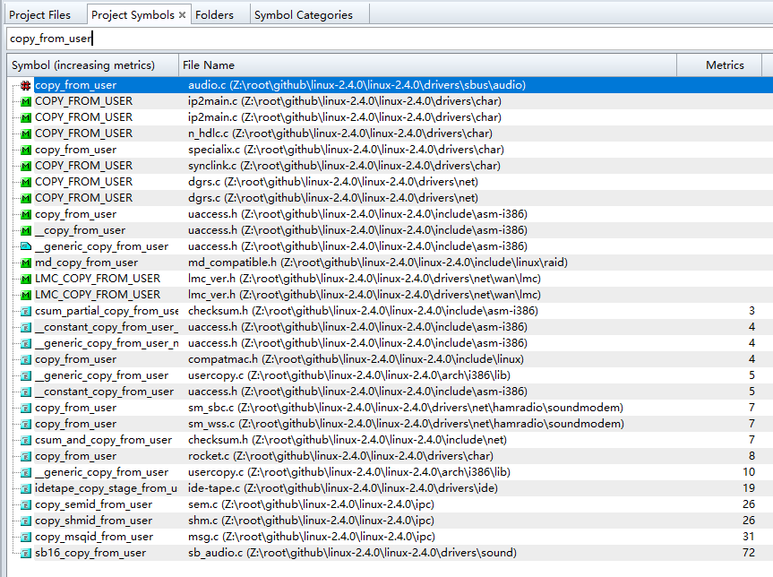
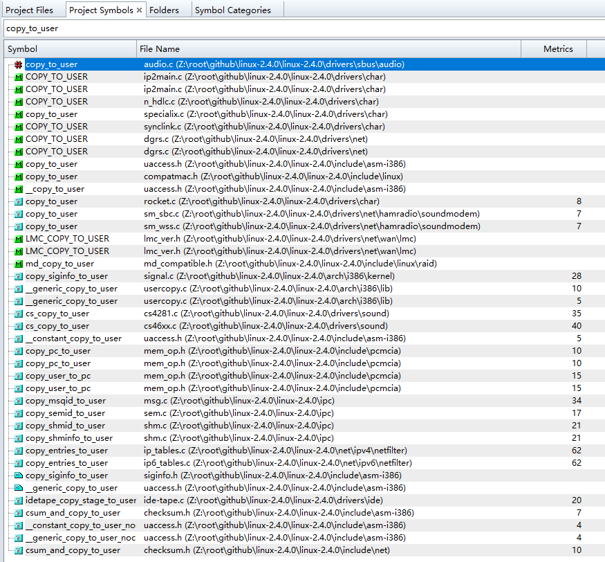

<!-- TOC depthFrom:1 depthTo:6 withLinks:1 updateOnSave:1 orderedList:0 -->

- [用户态与内核态间数据传递操作的本质](#用户态与内核态间数据传递操作的本质)
	- [copy_from_user拷贝用户态数据到内核](#copyfromuser拷贝用户态数据到内核)
		- [copy_from_user(kernel 2.4)](#copyfromuserkernel-24)
		- [copy_from_user(kernel 2.6)](#copyfromuserkernel-26)
	- [copyt_to_user拷贝内核数据到用户](#copyttouser拷贝内核数据到用户)
		- [copy_to_user(kernel 2.4)](#copytouserkernel-24)
		- [copy_to_user(kernel 2.6)](#copytouserkernel-26)
	- [END](#end)

<!-- /TOC -->

# 用户态与内核态间数据传递操作的本质


原理上，内核态是可以直接访问用户态的虚拟地址空间的，所以如果需要在内核态获取用户态地址空间的数据的话，理论上应该是可以直接访问的，但为什么还需要使用copy_from_user接口呢？

因为：直接访问的话，无法保证被访问的用户态虚拟地址是否有对应的页表项，即无法保证该虚拟地址已经分配了相应的物理内存，如果此时没有对应的页表项，那么此时将产生page fault，导致流程混乱，原则上如果没有页表项(即没有物理内存时)，是不应该对其进行操作的。

所以直接操作有比较大的风险，而copy_from_user本质上也只是做了相关判断和校验，保证不会出现相关异常而已。


## copy_from_user拷贝用户态数据到内核

### copy_from_user(kernel 2.4)



```
  #define copy_from_user memcpy_fromfs
```

```
int copy_from_user(void *to, const void *from_user, unsigned long len)
{
	int	error;

	error = verify_area(VERIFY_READ, from_user, len);
	if (error)
		return len;
	memcpy_fromfs(to, from_user, len);
	return 0;
}
```


### copy_from_user(kernel 2.6)

---

## copyt_to_user拷贝内核数据到用户

### copy_to_user(kernel 2.4)



```
  #define copy_to_user memcpy_tofs
```


```
int copy_to_user(void *to_user, const void *from, unsigned long len)
{
	int	error;

	error = verify_area(VERIFY_WRITE, to_user, len);
	if (error)
		return len;
	memcpy_tofs(to_user, from, len);
	return 0;
}

```


### copy_to_user(kernel 2.6)


## END
